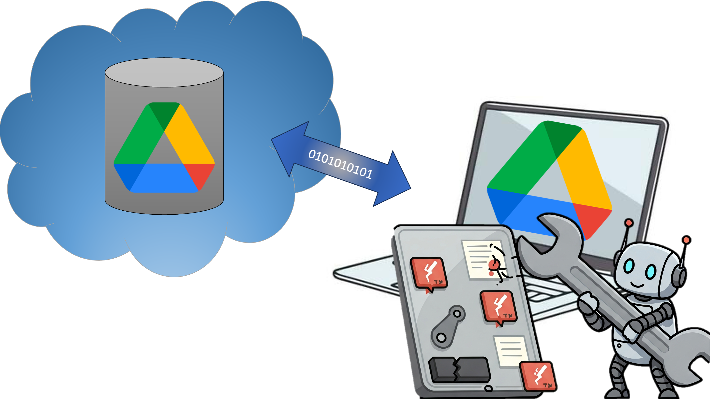

# Google Drive Backup Fixer Utility

**Author:** GitWyd
**License:** MIT





## Is Your Local Google Drive Backup Incomplete? This Tool Can Help!

Have you ever backed up your Google Drive locally, only to find that many Google Docs, Sheets, Slides, or shared files were copied as tiny placeholder files (often `.gdoc`, `.gsheet`, `.gslides` or just small, empty files) instead of the actual content? This utility is designed to fix that!

The **Google Drive Backup Fixer** scans your local backup, identifies these placeholder files, connects to your Google Drive via the official API, and attempts to download the full versions, exporting Google Workspace files into common formats like `.docx`, `.xlsx`, and `.pptx`.

## Features

* **Scans Local Backups:** Identifies potential placeholder files based on small file size and specific Google shortcut extensions.
* **Intelligent ID Extraction:** Parses `.gdoc`, `.gsheet`, etc., files to extract the actual Google Drive file ID for accurate lookup.
* **Name-Based Fallback:** For other small files, it attempts to find them on Google Drive by their filename.
* **Google Drive API Integration:** Securely connects to your Google Drive to fetch files.
* **Format Conversion:** Exports Google Docs, Sheets, Slides, and Drawings to standard formats:
    * Google Docs &rarr; `.docx` (Microsoft Word)
    * Google Sheets &rarr; `.xlsx` (Microsoft Excel)
    * Google Slides &rarr; `.pptx` (Microsoft PowerPoint)
    * Google Drawings &rarr; `.png`
* **Direct Download:** Downloads non-Google files (PDFs, images, etc.) that were placeholders.
* **Logging:** Creates a `lost_or_failed_files.txt` log detailing any files that couldn't be found on Google Drive, couldn't be downloaded, or encountered other errors.
* **DEMO Mode:** Run the script in a "dry run" mode (`DEMO_MODE = True`) to see what actions it *would* take without modifying any local files.
* **Permission Checks:** Includes a pre-run check to verify write permissions to your backup directory (when not in Demo Mode).
* **Idempotent Design:** Avoids re-processing files it has already successfully handled and renamed (files ending in `.placeholder_original`).

## ⚠️ Important Disclaimer & Warnings

* **BACKUP YOUR BACKUP FIRST!** Before running this script in non-Demo mode (where it modifies files), it is **STRONGLY RECOMMENDED** that you create a separate copy of your local Google Drive backup. This script modifies your local backup by renaming placeholders and downloading new files.
* **Permissions:** This script will require read access to your Google Drive (it uses read-only scopes by default) and read/write/delete access to your local backup directory to save downloaded files and rename placeholders.
* **API Usage:** This script uses the Google Drive API. Excessive use with extremely large drives *could* lead to temporary API rate limiting by Google. For most personal or small business backups, this should not be an issue.
* **No Guarantees:** This tool is provided "as-is" without any warranties. While designed to be helpful, data recovery can be complex.

## Prerequisites

1.  **Python:** You need Python 3.7 or newer installed on your system. You can download it from [python.org](https://www.python.org/downloads/).
2.  **pip:** Python's package installer, which usually comes with Python.

## Installation

1.  **Download the Script:**
    * Save the Python script provided (let's call it `drive_backup_fixer.py`) to a directory on your computer.

2.  **Install Required Python Libraries:**
    Open your terminal or command prompt and run the following command to install the necessary Google API client libraries:
    ```bash
    pip install --upgrade google-api-python-client google-auth-httplib2 google-auth-oauthlib
    ```

## Configuration: The Crucial Steps

Proper configuration is key to making this script work. This involves two main parts: setting up Google Cloud credentials and configuring the script itself.

### Part 1: Setting Up Google Cloud Project & Drive API Credentials

This script needs to authenticate with Google to access your Drive. You'll create "Desktop app" credentials, which means the script will run locally on your machine.

1.  **Navigate to Google Cloud Console:**
    * Open your web browser and go to the [Google Cloud Console](https://console.cloud.google.com/).
    * If you don't have an account, you'll need to sign up (it's free to get started).

2.  **Create or Select a Project:**
    * At the top of the page, click the project dropdown.
    * Either select an existing project or click "**NEW PROJECT**".
        * If creating a new project, give it a name (e.g., "My Drive Scripts", "Backup Fixer Project") and click "**CREATE**".

3.  **Enable the Google Drive API:**
    * Once your project is selected, use the search bar at the top and search for "**Google Drive API**".
    * Click on "Google Drive API" from the search results.
    * If the API is not already enabled, click the "**ENABLE**" button. Wait for it to complete.

4.  **Create OAuth 2.0 Client ID Credentials:**
    * In the sidebar (you might need to click the "hamburger" menu ☰ icon), navigate to "**APIs & Services**" > "**Credentials**".
    * Click the "**+ CREATE CREDENTIALS**" button at the top of the page.
    * Select "**OAuth client ID**" from the dropdown list.
    * **Configure OAuth Consent Screen (if prompted):**
        * If this is your first time creating an OAuth ID in this project, you might be asked to configure the consent screen.
        * Choose "**External**" for User Type if you are using a personal Gmail account. If you are using a Google Workspace account and this script is for internal use, you *might* choose Internal, but External is generally fine. Click **CREATE**.
        * **App information:**
            * **App name:** Something like "My Drive Backup Fixer Script" (this is what you'll see on the consent screen).
            * **User support email:** Select your email address.
            * **App logo:** (Optional)
        * **Developer contact information:** Enter your email address.
        * Click "**SAVE AND CONTINUE**" through the "Scopes" and "Test users" sections. You don't need to add scopes here. For "Test users", you can add your own Google account email if you chose "External" and your app is in "testing" mode (this is the default for new apps).
        * Finally, click "**BACK TO DASHBOARD**" on the Summary page for the OAuth consent screen.
    * **Create the OAuth Client ID:**
        * Go back to "**APIs & Services**" > "**Credentials**".
        * Click "**+ CREATE CREDENTIALS**" > "**OAuth client ID**" again.
        * For "**Application type**", select "**Desktop app**" from the dropdown.
        * Give it a **Name** (e.g., "Drive Backup Fixer Client", "My Local Script").
        * Click the "**CREATE**" button.

5.  **Download `credentials.json`:**
    * A popup will appear showing your "Client ID" and "Client secret". **You don't need to copy these directly.**
    * Instead, on the right side of that popup (or in the list of OAuth 2.0 Client IDs if the popup closes), click the **DOWNLOAD JSON** icon (it looks like a downward arrow).
    * This will download a file. **Rename this file to `credentials.json`**.
    * **VERY IMPORTANT:** Move this `credentials.json` file into the **same directory** where you saved the `drive_backup_fixer.py` script.

### Part 2: Configuring the Script (`drive_backup_fixer.py`)

Open the `drive_backup_fixer.py` script in a text editor and modify the following configuration variables at the top of the file:

1.  **`LOCAL_BACKUP_PATH` (Required):**
    * This is the **full path** to the root directory of your local Google Drive backup. The script will scan this directory and its subdirectories.
    * **Example for Windows:** `LOCAL_BACKUP_PATH = r"C:\Users\YourUser\MyGoogleDriveBackup"` (the `r""` is important for paths with backslashes)
    * **Example for macOS/Linux:** `LOCAL_BACKUP_PATH = "/Users/youruser/MyGoogleDriveBackup"`
    * **Replace `"/path/to/your/local/google-drive-backup"` with your actual path.**

2.  **`DEMO_MODE` (Highly Recommended for First Run):**
    * `DEMO_MODE = True`: The script will run, connect to Google Drive, identify files, and log what it *would* do, but it **will not download any files or modify your local file system**. This is safe for a first run to see what the script finds.
    * `DEMO_MODE = False`: The script will perform all actions, including downloading files and renaming placeholders. **Use with caution and only after backing up your backup.**

3.  **`SIZE_THRESHOLD_BYTES` (Optional):**
    * Default: `256` (bytes). Files smaller than this size will be considered potential placeholders and checked against Google Drive. You can adjust this if your placeholder files are slightly larger.

4.  **`EXCLUDED_EXTENSIONS` (Optional):**
    * Default: `[".ini"]`. A list of file extensions (lowercase, including the dot) to ignore during the scan. The script also internally always ignores `.placeholder_original` (its own marker for processed files) and `.ds_store` (macOS metadata files).
    * You can add other extensions like `[".ini", ".tmp", ".DS_Store"]`.

## How to Run the Script

1.  **Open Terminal or Command Prompt:**
    * Navigate to the directory where you saved `drive_backup_fixer.py` and `credentials.json`.
    * Example: `cd /path/to/your/script_directory`

2.  **Run the Script:**
    * Execute the script using Python:
        ```bash
        python drive_backup_fixer.py
        ```

3.  **First Run - Google Authentication:**
    * The first time you run the script (or if `token.json` is missing/invalid), your web browser will automatically open.
    * You'll be asked to log in to your Google account (the one whose Drive you want to access).
    * You'll then see a consent screen asking for permission for the script (e.g., "My Drive Backup Fixer Script" or whatever you named it in the Cloud Console) to "View files in your Google Drive" (or similar, based on read-only scope).
    * Click "**Allow**" (or the affirmative option).
    * The page may say "Authentication successful, you can close this window."
    * The script will then create a `token.json` file in its directory. This file stores your authorization token so you don't have to re-authorize every time. **Keep `token.json` secure if it contains sensitive access tokens.**

4.  **Subsequent Runs:**
    * The script will use the `token.json` to automatically authenticate. If `token.json` becomes invalid or is deleted, you'll be prompted to re-authorize via the browser.

## Understanding the Output

* **Console Output:** The script will print its progress to the terminal, including:
    * Connection status to Google Drive.
    * Files it's currently processing.
    * Whether it found the file on Drive by ID or name.
    * Details of downloads/exports (or simulated actions in Demo Mode).
    * Errors encountered.
* **`lost_or_failed_files.txt`:**
    * After the script finishes, if any files could not be processed, downloaded, or were not found, their local paths and the reason for the failure will be logged in this text file (created in the same directory as the script).
    * Review this file carefully to understand which files might need manual attention or could not be recovered by the script.

## Troubleshooting Common Issues

* **`[Errno 1] Operation not permitted` (or similar permission errors) when saving/renaming files:**
    * **Cause:** The script doesn't have write/delete permissions for your `LOCAL_BACKUP_PATH` or specific subfolders/files within it.
    * **Solution:**
        * Ensure the user running the script has write permissions to the entire backup directory tree.
        * **On macOS:** Files or folders might be "locked." You can unlock them recursively by opening Terminal and carefully running:
            ```bash
            chflags -R nouchg "/your/full/path/to/LOCAL_BACKUP_PATH"
            ```
            Replace the path with your actual `LOCAL_BACKUP_PATH`. Be very careful with `chflags -R`.
        * The script has a pre-run write check for the root backup directory when not in Demo mode, which should catch general permission issues there.

* **`File not found on Google Drive (404 Error)` for a specific File ID:**
    * **Cause:** The File ID extracted from your local placeholder file (e.g., `.gdoc`) no longer corresponds to an existing file on your Google Drive, or the authenticated user doesn't have permission to access it. The file might have been deleted, moved to trash and emptied, or its permissions changed.
    * **Action:** This file is likely lost from Drive or inaccessible. Check your Google Drive trash if recent.

* **`File too large for API export`:**
    * **Cause:** Google Drive has a size limit (often around 10MB) for exporting Google Docs, Sheets, or Slides via the API.
    * **Action:** These files need to be downloaded manually from the Google Drive website (File > Download). The script will log them so you know which ones.

* **`Google Form (unsupported for useful export by this script)`:**
    * **Cause:** Google Forms are not simple files and cannot be "exported" into a single, editable document by this script's methods.
    * **Action:** For form responses, link the Form to a Google Sheet and back up that Sheet. For the form structure itself, consider using Google Takeout for a comprehensive backup or manual methods.

* **Python `ModuleNotFoundError`:**
    * **Cause:** Required libraries are not installed.
    * **Solution:** Re-run `pip install --upgrade google-api-python-client google-auth-httplib2 google-auth-oauthlib`.

* **Authentication Errors / `token.json` issues (e.g., `invalid_grant`):**
    * **Cause:** The `token.json` might be corrupted, expired in a non-refreshable way, or permissions changed on the Google account.
    * **Solution:** Delete the `token.json` file. The script will then re-initiate the browser-based authentication process on its next run.

* **Script doesn't find expected placeholder files:**
    * Check `SIZE_THRESHOLD_BYTES` – are your placeholders larger?
    * Check `EXCLUDED_EXTENSIONS` – are you accidentally excluding the placeholders?
    * Ensure `LOCAL_BACKUP_PATH` is correct.

## How It Works (Briefly)

1.  **Scans Local Files:** Recursively walks through your specified `LOCAL_BACKUP_PATH`.
2.  **Identifies Placeholders:**
    * Checks for files smaller than `SIZE_THRESHOLD_BYTES`.
    * Excludes files with extensions in `EXCLUDED_EXTENSIONS` (and its internal list: `.placeholder_original`, `.ds_store`).
    * For files with Google-specific extensions like `.gdoc`, `.gsheet`, etc., it attempts to parse them as JSON to extract the unique Google Drive File ID.
3.  **Connects to Google Drive:** Uses your `credentials.json` and `token.json` to authenticate with the Google Drive API.
4.  **Finds & Downloads:**
    * **By ID:** If a File ID was extracted, it queries Google Drive directly for that file. This is the most reliable method.
    * **By Name:** If no ID was extracted (e.g., for a generic small PDF placeholder), it searches for a file with the same name on Google Drive. This can sometimes be ambiguous if you have multiple files with the same name.
    * **Export/Download:**
        * If the Drive file is a Google Workspace type (Doc, Sheet, Slide, Drawing), it uses the API's `export` function to convert it to the corresponding Office/PNG format and downloads it.
        * For other file types (PDFs, images, Colab notebooks, etc.), it downloads them directly.
5.  **File Handling (Non-Demo Mode):**
    * The original local placeholder file (e.g., `MyDoc.gdoc`) is renamed to `MyDoc.gdoc.placeholder_original`.
    * The newly downloaded/exported full file (e.g., `MyDoc.docx`) is saved in its place.
6.  **Logs Issues:** Any file that cannot be found, accessed, downloaded, or exported is added to `lost_or_failed_files.txt` with a reason.

## Contributing

Found a bug or have a feature request? Feel free to open an issue on the repository where you found this script (if applicable) or contact the author.

---

## License

MIT License

Copyright (c) 2025 GitWyd

Permission is hereby granted, free of charge, to any person obtaining a copy
of this software and associated documentation files (the "Software"), to deal
in the Software without restriction, including without limitation the rights
to use, copy, modify, merge, publish, distribute, sublicense, and/or sell
copies of the Software, and to permit persons to whom the Software is
furnished to do so, subject to the following conditions:

The above copyright notice and this permission notice shall be included in all
copies or substantial portions of the Software.

THE SOFTWARE IS PROVIDED "AS IS", WITHOUT WARRANTY OF ANY KIND, EXPRESS OR
IMPLIED, INCLUDING BUT NOT LIMITED TO THE WARRANTIES OF MERCHANTABILITY,
FITNESS FOR A PARTICULAR PURPOSE AND NONINFRINGEMENT. IN NO EVENT SHALL THE
AUTHORS OR COPYRIGHT HOLDERS BE LIABLE FOR ANY CLAIM, DAMAGES OR OTHER
LIABILITY, WHETHER IN AN ACTION OF CONTRACT, TORT OR OTHERWISE, ARISING FROM,
OUT OF OR IN CONNECTION WITH THE SOFTWARE OR THE USE OR OTHER DEALINGS IN THE
SOFTWARE.
